# APEX — Autonomous Predictive & EXecutive Race Intelligence

<p align="center">
  
  
  
  
  
  
  
  
  
</p>

**APEX** is a Formula 1 team pit-wall decision intelligence and mission control platform. Given real-time telemetry from race tracks, APEX maintains a high-fidelity stochastic digital twin, forecasts non-linear tyre wear and Markov weather transitions, computes physical lap-time Delta-T decompositions, performs 1,000-rollout Monte Carlo stochastic rollouts, and provides transparent explainability via TreeSHAP and Deep Q-Networks (DQN).

---

## 🏎️ Complete Enterprise Architecture

```mermaid
flowchart TD
    subgraph CircuitViews ["🗺️ 1. Multi-Mode Circuit Engine"]
        V2D["2D Vector Circuit Map<br/>(Silverstone, Monza, Spa, Monaco, Interlagos)"]
        Heat["Micro-Sector Speed Heatmap"]
        Ribbon["Linear Gap Progression Ribbon"]
        MiniSec["20 Mini-Sector Micro-Timing Grid"]
    end

    subgraph TelemetrySuite ["📊 2. Live Telemetry & Dynamics"]
        HUD["4-Corner Tyre Thermal Matrix (FL, FR, RL, RR)"]
        Radar["Pit Rejoin & Clean Air Window Radar"]
        Battle["Head-to-Head Battle Radar"]
        Weather["10-Lap Doppler Weather Radar"]
        DVR["Telemetry DVR Time-Travel Scrubber"]
        Dual["Dual-Driver Overlay Comparator"]
        Aero["🏎️ Chassis Aero & Balance Tuner"]
        DeltaT["⏱️ Lap Time Delta-T Physical Decomposition"]
    end

    subgraph StrategySuite ["🎯 3. Decision Intelligence & RL"]
        Gantt["Stint Strategy Gantt Matrix"]
        CF["4-Lap Forward Counterfactuals"]
        Tree["Explainability Reasoning Tree"]
        Sandbox["Interactive Scenario Sandbox"]
        Copilot["🤖 AI Pit Wall Strategist Copilot"]
        DQN["DQN Neural Policy & Q-Value Tensor Inspector"]
        Monte["🎲 Monte Carlo 1,000-Rollout Stochastic Engine"]
        SHAP["🔍 SHAP Feature Attribution Waterfall"]
        Iso["🗺️ Multi-Lap Pit Strategy Isochrone Surface"]
        Threat["🎯 Competitor Undercut/Overcut Threat Radar"]
    end

    subgraph CrewAudio ["⏱️ 4. Crew, Championship & Audio DSP"]
        Chirp["Team Radio Tone Synthesizer & Static DSP"]
        V6["🏎️ V6 Turbo Hybrid Audio Synthesizer"]
        Voice["Multi-Persona Voice Profiles (Bono, GP, Xavi, APEX)"]
        Wave["142.850 MHz Neon Audio Waveform"]
        PitSim["Interactive Pit Crew Stopwatch Drill"]
        Log["📋 Race Event Logger & CSV Exporter"]
        Standings["Live FIA World Championship Standings"]
        Podium["Grand Prix Podium & Post-Race Debrief"]
    end

    CircuitViews --- TelemetrySuite
    TelemetrySuite --- StrategySuite
    StrategySuite --- CrewAudio
```



---

## 🌟 Flagship Feature Suite (21 Modules)

### 🧠 Explainable AI & Decision Intelligence
1. **🔍 SHAP Feature Attribution Waterfall**: Shapley additive explanation chart decomposing exact positive and negative feature contributions towards AI confidence score $f(x)$.
2. **🧠 DQN Neural Network Policy Tensor Inspector**: Live 28-D normalized input state tensor and Q-value distribution across all 8 strategic actions (`MAINTAIN`, `PUSH`, `CONSERVE`, `PIT_SOFT`, `PIT_MEDIUM`, `PIT_HARD`, `PIT_INTER`, `PIT_WET`).
3. **🎲 Monte Carlo 1,000-Rollout Strategy Simulator**: 1,000 parallel stochastic forward simulations with Gaussian pace variance and safety car probability distributions.
4. **🗺️ Multi-Lap Pit Strategy Isochrone Matrix**: 2D parameter grid identifying the global minimum total race time valley across laps and compounds.
5. **🤖 AI Pit Wall Strategist Copilot**: Conversational AI assistant with quick tactical prompts and text-to-speech audio dispatcher.
6. **🎯 Competitor Undercut & Overcut Threat Radar**: Real-time threat matrix evaluating pit box overlap and outlap pace deltas.

### 📊 Telemetry, Vehicle Physics & Aerodynamics
7. **⏱️ Lap Time Delta-T Physical Decomposition**: Decomposes lap times into fuel mass $(+s)$, tyre degradation $(+s)$, dirty air wake $(+s)$, ERS hybrid boost $(-s)$, and DRS gain $(-s)$.
8. **🏎️ Chassis Aerodynamics & Setup Balancer**: Live tuning for Front/Rear Wing angles, Brake Bias %, Differential lock %, and Top Speed vs Lateral G curves.
9. **👥 Dual-Driver Comparative Telemetry Overlay**: Overlaid waypoint velocity curves and tyre wear differentials vs any competitor.
10. **⏱️ 20 Mini-Sector Micro-Timing Matrix**: Micro-sector splits across 20 track segments (**Purple** = Session Best, **Green** = Personal Best, **Yellow** = Slower).
11. **⏪ Race Telemetry DVR & Time-Travel Scrubber**: Historical replay scrubber allowing engineers to inspect telemetry at any past lap.
12. **🏎️ 4-Corner Tyre Thermal Matrix**: Real-time FL, FR, RL, RR carcass thermals and surface wear rates.
13. **🌦️ 10-Lap Doppler Weather Radar**: Forward rain probability curve with intermediate (35%) and wet (70%) crossover lines.
14. **⚔️ Head-to-Head Driver Battle Radar**: DRS detection, slipstream delta (+14.2 km/h), and overtake probability %.

### 🗺️ Circuits, Audio & Mission Control
15. **🗺️ Multi-Circuit Vector Engine**: Bespoke SVG vector geometries for **Silverstone**, **Monza**, **Spa-Francorchamps**, **Monaco**, and **Interlagos**.
16. **🎙️ Multi-Persona Race Engineer Voice Comms**: Voice personas for **APEX Core AI**, **"Bono"** (*"Hammer time, box box box"*), **"GP"** (*"Manage the tyres, delta is good"*), and **"Xavi"** (*"Plan A, we are checking"*).
17. **📻 Authentic F1 Radio Bandpass & Static Filter DSP**: Web Audio API biquad filter + white noise static burst generator simulating cockpit radio communications.
18. **🏎️ V6 Turbo Hybrid Audio Synthesizer**: Web Audio API FM oscillator generating authentic Formula 1 engine whine matching live RPM.
19. **⏱️ Interactive Pit Crew Stopwatch**: 5-gantry light reaction drill measuring stationary pit duration with pneumatic wheel gun audio.
20. **🏆 Live World Championship Leaderboard**: Dynamic Drivers' and Teams' Championship standings with fastest lap (+1 pt) bonus calculation.
21. **📋 Race Event Telemetry Logger & CSV Exporter**: Chronological incident feed with downloadable `.CSV` reports.

---

## 📊 Evaluation & Benchmark Matrix

Automated head-to-head evaluation across 15 seeded 52-lap races on the **Silverstone Grand Prix Circuit**:

| Policy | Avg Finishing Position | Win Rate (%) | Podium Rate (%) | Avg Gap to P1 (s) | Blown Tyre Laps | Avg Pit Stops |
| :--- | :---: | :---: | :---: | :---: | :---: | :---: |
| **RANDOM BASELINE** | 7.40 | 13.3% | 26.7% | +87.68s | 19.53 | 0.0 |
| **RULE-BASED ENGINE** | **1.07** | **93.3%** | **100.0%** | **+0.23s** | **0.00** | 3.5 |
| **TRAINED DQN POLICY** | 4.33 | 53.3% | 60.0% | +79.43s | 9.87 | 2.2 |

---

## 📁 Repository Structure

```
APEX/
├── pyproject.toml                         # Python project & dependencies (uv managed)
├── docker-compose.yml                     # Redis + Postgres container configuration
├── README.md                              # Flagship system documentation
├── backend/
│   ├── app/
│   │   ├── simulator/                     # Deterministic physics engine & Pydantic models
│   │   ├── intelligence/                  # Feature builder, tyre & weather models
│   │   ├── strategy/                      # Rule engine, Gymnasium RL env, DQN agent, counterfactuals, explainability
│   │   ├── twin/                          # State persistence store
│   │   ├── api/                           # FastAPI routes & WebSocket broadcaster
│   │   └── main.py                        # FastAPI entry point
│   ├── training/                          # RL training scripts
│   └── tests/                             # Pytest integration & unit test suite
├── frontend/                              # React 18 + Vite + Tailwind Mission Control
│   ├── src/
│   │   ├── components/                    # 21 Mission Control components (SHAP, Monte Carlo, DVR, Gantt, etc.)
│   │   ├── data/                          # Multi-circuit vector geometries (Silverstone, Monza, Spa, etc.)
│   │   ├── utils/                         # audioEngine (DSP + Personas + V6 Synth), clientSimulator (Twin)
│   │   ├── store/                         # Zustand state store
│   │   └── hooks/                         # useRaceSocket WebSocket client & twin fallback
│   └── package.json
└── benchmarks/                            # Automated evaluation suite
    ├── run_benchmarks.py
    └── benchmark_report.md
```

---

## 🚀 Quick Start

### 1. Prerequisites
- **Python 3.11 - 3.12** & [`uv`](https://docs.astral.sh/uv/)
- **Node.js 18+** & `npm`

### 2. Install Dependencies & Build Frontend

```bash
# Install Python backend dependencies
uv sync

# Install Frontend dependencies & build bundle
cd frontend
npm install
npm run build
cd ..
```

### 3. Launch Mission Control Dashboard

```bash
uv run uvicorn backend.app.main:app --port 8000 --reload
```

Open your browser and navigate to **[http://localhost:8000](http://localhost:8000)** (or run `npm run dev` in `frontend/` for Vite HMR at **[http://localhost:5173](http://localhost:5173)**).

---

## 🧪 Testing & Automated Verification

```bash
# Run all unit and integration tests (9/9 passing)
uv run pytest

# Re-run automated strategy benchmark evaluation
uv run python benchmarks/run_benchmarks.py

# Train / fine-tune DQN policy
uv run python backend/training/train_dqn.py --steps 15000
```

---

## 📄 License
MIT License. Created by Susil.
