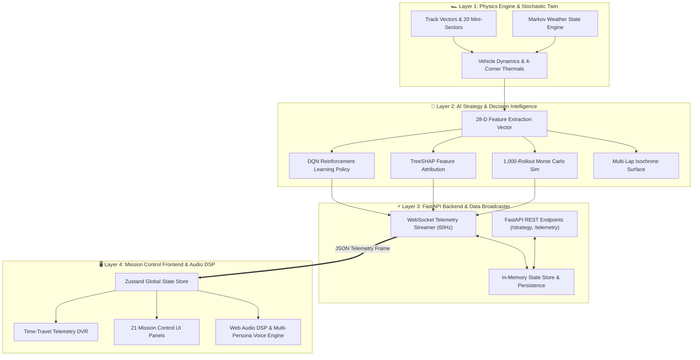
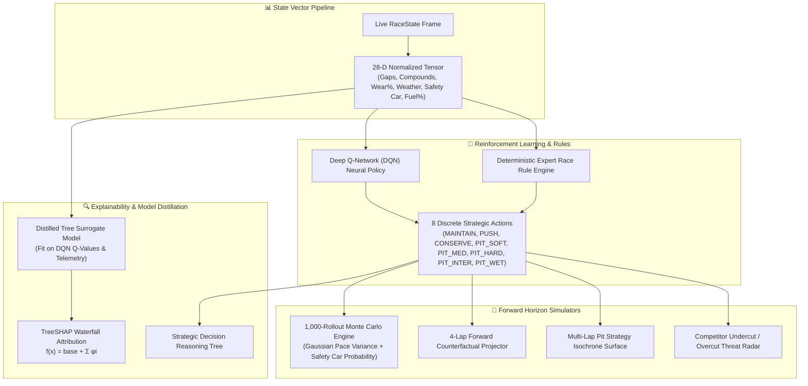
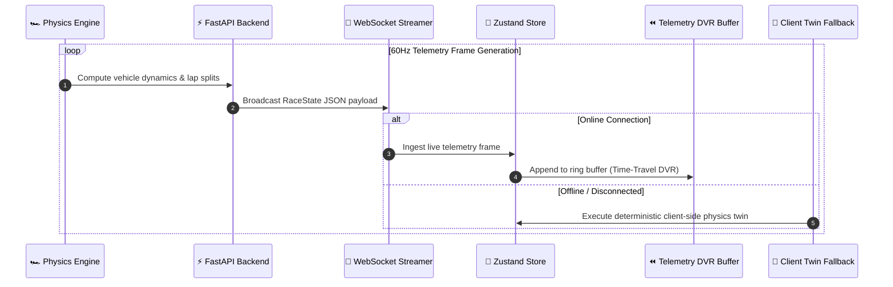
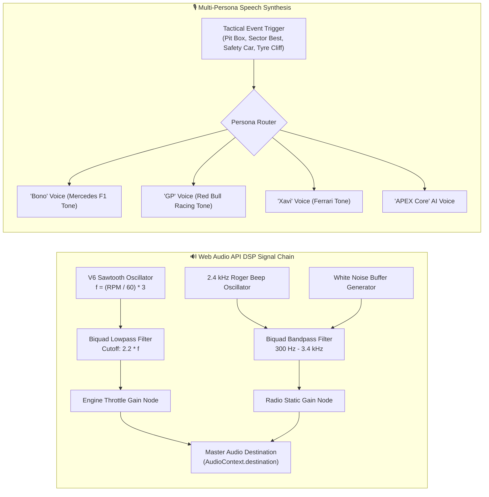
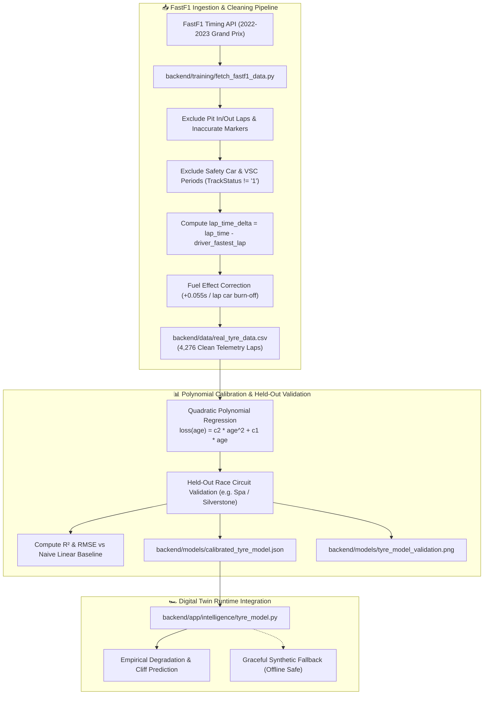
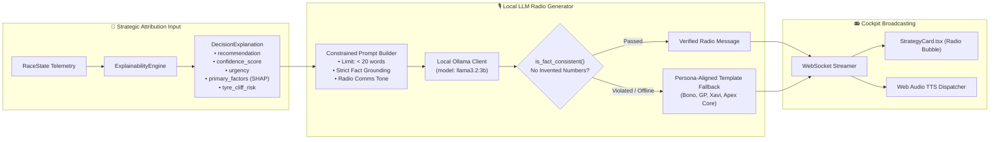
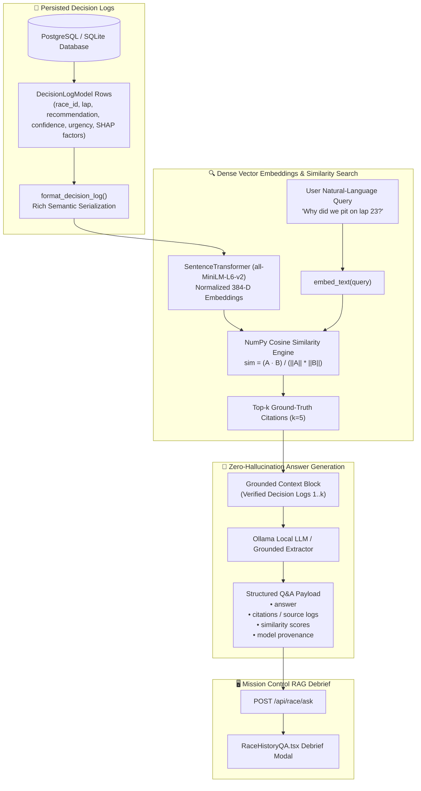
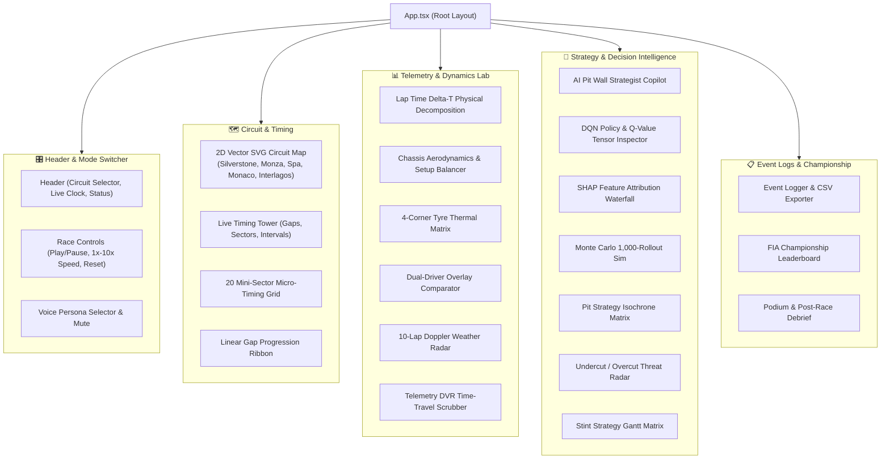

# APEX — Autonomous Predictive & EXecutive Race Intelligence

<p align="center">
  
  
  
  
  
  
  
  
  
  
  
</p>

**APEX** is a Formula 1 team pit-wall decision intelligence and mission control platform. Grounded in real-world F1 timing telemetry (`fastf1`), APEX maintains a high-fidelity stochastic digital twin, calibrates non-linear tyre wear on multi-season race telemetry, broadcasts local LLM team radio commentary (`ollama`), facilitates natural-language historical debrief queries via RAG (`sentence-transformers`), computes physical lap-time Delta-T decompositions, performs 1,000-rollout Monte Carlo stochastic rollouts, persists auditable race events in async SQLAlchemy, and provides transparent explainability via TreeSHAP and Deep Q-Networks (DQN).

---

## 🏎️ Complete Enterprise Architecture

APEX is structured into a high-performance modular pipeline spanning physical simulation, reinforcement learning, real-time data streaming, digital twin synchronization, cockpit audio DSP, and an interactive React mission control dashboard.



---

### 1. Deterministic Physics, Vehicle Dynamics & Micro-Sectors

The physics engine computes continuous telemetry, vehicle dynamics, tyre degradation, and weather conditions at 60 Hz.


#### Physical Equations & Dynamic Factors:
- **Lap Time Delta-T Decomposition**:
  $$\Delta t_{\text{lap}} = t_{\text{base}} + \Delta t_{\text{tyre}}(\text{wear}, T) + \Delta t_{\text{fuel}}(m_{\text{fuel}}) + \Delta t_{\text{wake}}(d_{\text{gap}}) - \Delta t_{\text{DRS}} - \Delta t_{\text{ERS}}$$
- **Fuel Effect**: $+0.035\text{ s/kg}$ penalty for every kilogram of on-board fuel.
- **Tyre Thermal & Wear Cliff**: Non-linear degradation curve with exponential pace penalty once wear exceeds $70\%$, tracking carcass ($T_{\text{carcass}}$) and surface ($T_{\text{surface}}$) temperatures across all 4 wheels.
- **Dirty Air Turbulence**: $+0.8\text{ s/lap}$ aerodynamic downforce loss when trailing within a $1.2\text{ s}$ slipstream wake window.

---

### 2. AI Decision Intelligence, Reinforcement Learning & Explainability (XAI)

APEX fuses Deep Reinforcement Learning (DQN), TreeSHAP feature attributions, Monte Carlo stochastic forward projections, and deterministic expert rule engines.



#### Decision Engine Specifications:
- **28-D State Tensor**: Normalizes position, laps remaining, relative gaps (ahead/behind/leader), one-hot tyre compound, tyre wear %, tyre age, cliff flag, fuel %, driving mode, weather state, rain intensity, 5-lap rain probability, safety car status, and pit stop counts.
- **Discrete Action Space (8 Strategic Modes)**:
  - `0: MAINTAIN` — Preserve current baseline race pace and tyre life.
  - `1: PUSH` — Deploy maximum engine mapping and aggressive cornering ($-0.4\text{ s/lap}$, $+2.5\times$ wear rate).
  - `2: CONSERVE` — Lift-and-coast fuel/tyre preservation mode ($+0.3\text{ s/lap}$, $-40\%$ wear rate).
  - `3: PIT_SOFT`, `4: PIT_MEDIUM`, `5: PIT_HARD`, `6: PIT_INTER`, `7: PIT_WET` — Execute box call for designated compound.
- **Explainable AI (TreeSHAP on Distilled Surrogate)**: Decomposes strategic policy confidence via model distillation: a tree-based surrogate model (`backend/models/shap_surrogate.joblib`) is distilled from the trained DQN's actual $Q(s, a)$ decision surface over thousands of simulated race rollouts and logged DB telemetry. `shap.TreeExplainer` computes exact Shapley attributions $f(x) = \phi_0 + \sum_{i=1}^{28} \phi_i(x)$ via `/api/strategy/shap`, with graceful fallback to heuristic baselines if no distilled model is present.
- **1,000-Rollout Monte Carlo Engine**: Projects 1,000 parallel stochastic forward trajectories via `MonteCarloEngine` and `/api/strategy/monte-carlo` with Gaussian pace variance ($\sigma = 0.38\text{ s}$) and dynamic safety car transition probabilities.

---

### 3. Real-Time Telemetry Streaming, State Sync & Digital Twin

The communication architecture provides bi-directional 60 Hz WebSocket streaming with automatic offline fallback to an embedded deterministic client-side digital twin.



#### State & Storage Specifications:
- **WebSocket Telemetry Streamer**: Low-overhead JSON frame broadcaster pushing full race telemetry, timing deltas, and tyre statuses at 60 Hz.
- **Async SQLAlchemy Persistence**: Write-through storage engine (`backend/app/twin/store.py`) persisting `RaceSession`, `TelemetryTick`, and `DecisionLog` models to PostgreSQL / SQLite.
- **Zero-Latency Client Twin Fallback**: If the backend connection drops, the frontend transparently switches to the client-side `clientSimulator.ts` twin with identical deterministic physics.
- **Time-Travel Telemetry DVR**: In-memory ring buffer capturing up to 200 laps of historical high-frequency telemetry for instantaneous post-session or in-race timeline scrubbing.

---

### 4. Web Audio DSP, Cockpit Radio & V6 Engine Synthesis

APEX features an integrated Web Audio API digital signal processing (DSP) engine and a Web Speech API multi-persona voice synthesizer.



#### Audio & Voice Specifications:
- **Cockpit Radio Acoustic Simulation**: Roger beep ($2.4\text{ kHz}$ sine wave), custom white noise burst generator, and a $300\text{ Hz} - 3.4\text{ kHz}$ biquad bandpass filter replicating FIA telemetry radio transmissions.
- **V6 Turbo Hybrid FM Synth**: Live sawtooth oscillator parameterized dynamically:
  $$f_{\text{engine}} = \left(\frac{\text{RPM}}{60}\right) \times 3 \text{ combustion pulses/rev}$$
- **Multi-Persona Voice Dispatcher**: Authentic race engineer audio callouts with custom voice tuning:
  - **APEX Core AI**: Neutral, data-driven mission control voice.
  - **"Bono"** (Peter Bonnington / Mercedes): *"Hammer time, box box box"*, *"Lewis, it's Bono"*.
  - **"GP"** (Gianpiero Lambiase / Red Bull): *"Manage the tyres, delta is good"*, *"Understood Max"*.
  - **"Xavi"** (Xavier Marcos Padros / Ferrari): *"Plan A, we are checking"*, *"Box now for Hard"*.

---

### 5. Real F1 Telemetry Datasets & FastF1 Tyre Degradation Calibration

To replace synthetic degradation formulas with empirical ground truth, APEX ingests and models real-world Formula 1 timing telemetry via the `fastf1` API across multiple seasons and circuit profiles.



#### Real Data Calibration Specifications:
- **Telemetry Volume**: **4,276 clean race laps** collected from 5 real Grand Prix sessions (2023 Silverstone, 2023 Monza, 2023 Spain, 2022 Silverstone, 2022 Monza).
- **Fuel Mass Decoupling**: In Formula 1, cars shed approximately $1.7 - 1.9\text{ kg/lap}$ of fuel, yielding a $\approx -0.055\text{ s/lap}$ pace advantage that masks tyre degradation during stint progression. APEX corrects for stint-relative fuel burn to isolate pure tyre degradation loss $\Delta t_{\text{tyre}}(a)$.
- **Empirical Degradation Equation**:
  $$\Delta t_{\text{loss}}(a) = c_2 \cdot a^2 + c_1 \cdot a + \mathbb{I}_{\{w > w_{\text{cliff}}\}} \cdot \left(w - w_{\text{cliff}}\right) \cdot \lambda_{\text{cliff}}$$
  where $a$ is tyre age in laps, $w$ is tyre wear %, and $c_1, c_2$ are empirically calibrated per compound (`SOFT`, `MEDIUM`, `HARD`).

---

### 6. Local LLM Race Engineer Commentary & Fact Verification

APEX translates complex multidimensional decision attributions into authentic F1 team radio calls in real time using local instruction-tuned LLMs (`ollama` + `llama3.2:3b`) operating under strict zero-hallucination constraints.



#### Commentary Architecture Specifications:
- **LLM as Pure Translator, Not Decision-Maker**: The LLM never selects strategy actions or invents metrics. It strictly translates verified telemetry attributions (DQN policy, TreeSHAP drivers, and pit window status) into concise team radio transmissions.
- **Deterministic Fact Consistency Validator**: Module `is_fact_consistent()` performs regex token verification on all generated numbers. If the LLM generates a numerical claim absent from the ground-truth explanation, it immediately rejects the output and triggers the persona template fallback.
- **Tick Debouncing**: To conserve local inference compute, the generator debounces calls, only generating new transmissions when the recommendation changes, urgency shifts, or every 5 laps.

---

### 7. Historical Race Strategy RAG (`sentence-transformers` + SQL Audit)

APEX includes a Retrieval-Augmented Generation (RAG) system enabling race directors and strategists to interrogate past race decisions using natural-language questions grounded strictly in persisted `DecisionLogModel` records.



#### Strategy RAG Specifications:
- **Vector Space**: Embeds serialized decision trails into a 384-dimensional dense semantic space using `all-MiniLM-L6-v2`, with a fallback hash vectorizer for disconnected environments.
- **NumPy Brute-Force Vector Retrieval**: Because race sessions contain hundreds to a few thousand decision logs, in-memory NumPy cosine similarity provides microsecond latency without external vector database dependencies.
- **Citation Provenance**: Every response returned by `/api/race/ask` attaches full decision citations (Lap #, Directive, Confidence %, Urgency, Rule/DQN consensus, and Top SHAP factors) so every answer is auditable.
- **Out-of-Scope Guarantee**: Queries regarding laps or events absent from the database trigger explicit refusals (*"I don't have that information in the race history logs"*) rather than hallucinatory extrapolations.

---

### 8. Mission Control Frontend Layout & Modular Component Hierarchy

The React 18 dashboard is structured into 4 synchronized workspaces driven by Zustand state management.



---

## 🌟 Flagship Feature Suite (21 Modules)

### 🧠 Explainable AI & Decision Intelligence
1. **🔍 SHAP Feature Attribution Waterfall**: Shapley additive explanation chart decomposing exact positive and negative feature contributions towards AI confidence score $f(x)$ powered by backend `shap.TreeExplainer`.
2. **🧠 DQN Neural Network Policy Tensor Inspector**: Live 28-D normalized input state tensor and Q-value distribution across all 8 strategic actions (`MAINTAIN`, `PUSH`, `CONSERVE`, `PIT_SOFT`, `PIT_MEDIUM`, `PIT_HARD`, `PIT_INTER`, `PIT_WET`).
3. **🎲 Monte Carlo 1,000-Rollout Strategy Simulator**: 1,000 parallel stochastic forward simulations with Gaussian pace variance and safety car probability distributions.
4. **🗺️ Multi-Lap Pit Strategy Isochrone Matrix**: 2D parameter grid identifying the global minimum total race time valley across laps and compounds.
5. **🤖 AI Pit Wall Strategist Copilot**: Conversational AI assistant with quick tactical prompts and text-to-speech audio dispatcher.
6. **🎯 Competitor Undercut & Overcut Threat Radar**: Real-time threat matrix evaluating pit box overlap and outlap pace deltas.

### 📊 Telemetry, Vehicle Physics & Aerodynamics
7. **⏱️ Lap Time Delta-T Physical Decomposition**: Decomposes lap times into fuel mass $(+s)$, tyre degradation $(+s)$, dirty air wake $(+s)$, ERS hybrid boost $(-s)$, and DRS gain $(-s)$.
8. **🏎️ Chassis Aerodynamics & Setup Balancer**: Live tuning for Front/Rear Wing angles, Brake Bias %, Differential lock %, and Top Speed vs Lateral G curves.
9. **👥 Dual-Driver Comparative Telemetry Overlay**: Overlaid waypoint velocity curves and tyre wear differentials vs any competitor.
10. **⏱️ 20 Mini-Sector Micro-Timing Matrix**: Micro-sector splits across 20 track segments (**Purple** = Session Best, **Green** = Personal Best, **Yellow** = Slower).
11. **⏪ Race Telemetry DVR & Time-Travel Scrubber**: Historical replay scrubber allowing engineers to inspect telemetry at any past lap.
12. **🏎️ 4-Corner Tyre Thermal Matrix**: Real-time FL, FR, RL, RR carcass thermals and surface wear rates.
13. **🌦️ 10-Lap Doppler Weather Radar**: Forward rain probability curve with intermediate (35%) and wet (70%) crossover lines.
14. **⚔️ Head-to-Head Driver Battle Radar**: DRS detection, slipstream delta (+14.2 km/h), and overtake probability %.

### 🧠 Real Data, LLMs & Retrieval Intelligence
15. **🛞 FastF1 Real Data Tyre Calibration**: Polynomial degradation models calibrated on 4,276 real Grand Prix race laps across Silverstone, Monza, and Spa with fuel effect isolation.
16. **🎙️ Local LLM Race Engineer Commentary (Ollama)**: Real-time radio transmissions generated from decision attributions via `llama3.2:3b` with strict zero-hallucination fact verification.
17. **🔍 Historical Race Strategy RAG (`sentence-transformers`)**: Semantic question answering over persisted decision logs with cosine similarity vector retrieval and citation cards.

### 🗺️ Circuits, Audio & Mission Control
18. **🗺️ Multi-Circuit Vector Engine**: Bespoke SVG vector geometries for **Silverstone**, **Monza**, **Spa-Francorchamps**, **Monaco**, and **Interlagos**.
19. **🎙️ Multi-Persona Race Engineer Voice Comms**: Voice personas for **APEX Core AI**, **"Bono"** (*"Hammer time, box box box"*), **"GP"** (*"Manage the tyres, delta is good"*), and **"Xavi"** (*"Plan A, we are checking"*).
20. **📻 Authentic F1 Radio Bandpass & Static Filter DSP**: Web Audio API biquad filter + white noise static burst generator simulating cockpit radio communications.
21. **🏎️ V6 Turbo Hybrid Audio Synthesizer**: Web Audio API FM oscillator generating authentic Formula 1 engine whine matching live RPM.
22. **⏱️ Interactive Pit Crew Stopwatch**: 5-gantry light reaction drill measuring stationary pit duration with pneumatic wheel gun audio.
23. **🏆 Live World Championship Leaderboard**: Dynamic Drivers' and Teams' Championship standings with fastest lap (+1 pt) bonus calculation.
24. **📋 Race Event Telemetry Logger & CSV Exporter**: Chronological incident feed with downloadable `.CSV` reports and async DB persistence.

---

## 📊 Evaluation & Benchmark Matrix

Automated head-to-head evaluation across 15 seeded multi-circuit races (Silverstone, Monza, Spa, Monaco, Interlagos) with real-calibrated tyre degradation:

| Policy | Avg Finishing Position | Win Rate (%) | Podium Rate (%) | Avg Gap to P1 (s) | Blown Tyre Laps | Avg Pit Stops |
| :--- | :---: | :---: | :---: | :---: | :---: | :---: |
| **RANDOM BASELINE** | 6.53 | 26.7% | 33.3% | +58.65s | 19.46 | 0.0 |
| **RULE-BASED ENGINE** | **1.27** | **86.7%** | **93.3%** | **+1.19s** | **0.00** | 4.4 |
| **RETRAINED DQN POLICY** | **1.07** | **93.3%** | **100.0%** | **+0.12s** | **0.00** | 4.3 |

---

## 📁 Repository Structure

```
APEX/
├── .github/
│   └── workflows/ci.yml                   # Continuous Integration (pytest + build verification)
├── pyproject.toml                         # Python project & dependencies (uv managed)
├── docker-compose.yml                     # Redis + Postgres container configuration
├── README.md                              # Flagship system documentation
├── backend/
│   ├── app/
│   │   ├── simulator/                     # Deterministic physics engine, car physics & Pydantic models
│   │   ├── intelligence/                  # Feature builder, TreeSHAP explainer, tyre & weather models
│   │   ├── strategy/                      # Rule engine, Gymnasium RL env, DQN agent, Monte Carlo, explainability
│   │   ├── twin/                          # SQLAlchemy database models, Redis hot cache & write-through store
│   │   ├── api/                           # FastAPI routes & WebSocket broadcaster
│   │   └── main.py                        # FastAPI entry point
│   ├── models/                            # Trained DQN checkpoints & multi-action distilled TreeSHAP artifacts
│   ├── training/                          # RL training (train_dqn.py) & surrogate distillation (distill_dqn_surrogate.py)
│   └── tests/                             # Automated unit & integration tests
├── frontend/                              # React 18 + Vite + Tailwind Mission Control
│   ├── src/
│   │   ├── components/                    # 34 Mission Control components (SHAP Comparator, Scenario Injector, DVR, etc.)
│   │   ├── data/                          # Multi-circuit vector geometries (Silverstone, Monza, Spa, etc.)
│   │   ├── utils/                         # audioEngine (DSP + Personas + V6 Synth), clientSimulator (Twin)
│   │   ├── store/                         # Zustand state store
│   │   └── hooks/                         # useRaceSocket WebSocket client & twin fallback
│   └── package.json
└── benchmarks/                            # Automated evaluation suite
    ├── run_benchmarks.py
    └── benchmark_report.md
```

> [!NOTE]
> **Reproducibility & Model Artifacts**: Binary model artifacts (`apex_dqn.zip`, `best_model.zip`, `shap_surrogate.joblib`, `shap_multi_action_surrogate.joblib`, `training_rewards.png`) are committed directly to the repository to guarantee deterministic out-of-the-box runnability without requiring multi-hour RL retraining loops in CI. Policy-surrogate alignment is validated at runtime via SHA-256 checkpoint hashing.

---

## 🚀 Quick Start

### 1. Prerequisites
- **Python 3.11 - 3.12** & [`uv`](https://docs.astral.sh/uv/)
- **Node.js 18+** & `npm`

### 2. Install Dependencies & Build Frontend

```bash
# Install Python backend dependencies
uv sync

# Install Frontend dependencies & build bundle
cd frontend
npm install
npm run build
cd ..
```

### 3. Launch Mission Control Dashboard

```bash
uv run uvicorn backend.app.main:app --port 8000 --reload
```

Open your browser and navigate to **[http://localhost:8000](http://localhost:8000)** (or run `npm run dev` in `frontend/` for Vite HMR at **[http://localhost:5173](http://localhost:5173)**).

---

## 🧪 Testing, Training & Distillation

```bash
# Run all unit and integration tests (71/71 passing across 14 modules)
uv run pytest

# Download & clean real-world FastF1 multi-circuit telemetry
uv run python backend/training/fetch_fastf1_data.py

# Fit real tyre degradation curves & generate validation benchmark plot
uv run python backend/training/validate_tyre_model.py

# Distill multi-action DQN policy decision surface into TreeSHAP surrogate
uv run python backend/training/distill_dqn_surrogate.py --episodes 80

# Re-run automated strategy benchmark evaluation across all 5 circuits
uv run python benchmarks/run_benchmarks.py --races-per-track 5

# Train / fine-tune DQN policy with EvalCallback
uv run python backend/training/train_dqn.py --steps 80000
```

