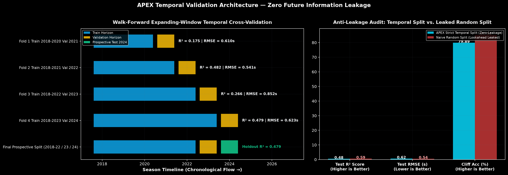
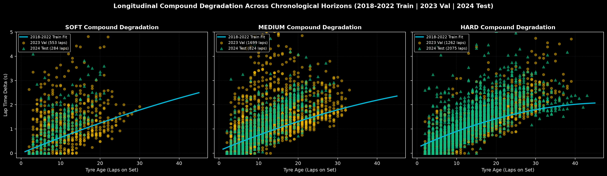

# F1 APEX — Autonomous Predictive & Executive Race Intelligence

Predicts how a Formula 1 driver will finish a race, using real F1 data — then layers live strategy intelligence (tyre wear, pit windows, what-if scenarios) on top, the way an actual pit wall works.

[](docs/EVALUATION.md)
[](docs/EVALUATION.md)
[](pyproject.toml)
[](frontend/)
[](docs/ARCHITECTURE.md)

**Two ways to use it:**
- **Simple Mode (V1 Baseline)**: Pick a real Grand Prix and driver, get an instant point-in-time predicted finish, confidence band, and plain-English factor weights.
- **Pit-Wall Mode (V2 Strategy Engine)**: The complete 60Hz race-strategy command center: live FastF1 tyre degradation, 1,000-run Monte Carlo simulations, TreeSHAP feature attributions, and LangGraph multi-agent deliberation.

[Run it yourself in 2 minutes](docs/HOW_TO_RUN.md) · [System Architecture](docs/ARCHITECTURE.md) · [Reproducible Evaluation](docs/EVALUATION.md)

---

## Quick Start (Run it in 2 minutes)

The entire platform (PostgreSQL, Redis, Kafka event broker, FastAPI intelligence server, and Vite UI) runs locally with one command:

```bash
# 1. Clone the repository
git clone https://github.com/Susil-commits/F1-s-APEX----Autonomous-Predictive-EXecutive-Race-Intelligence-.git
cd F1-s-APEX----Autonomous-Predictive-EXecutive-Race-Intelligence-

# 2. Launch the full stack
docker compose up
```

Open [http://localhost:5173](http://localhost:5173) in your browser.

> **Prefer running just the lightweight V1 predictor without Docker?**
> ```bash
> uv run uvicorn core.api.main:app --port 8000 --reload
> ```
> See the [Step-by-Step Running Guide](docs/HOW_TO_RUN.md) for full instructions.

---

## Two Operating Modes

```
+-----------------------------------------------------------------------------------+
|                                  F1 APEX HEADER                                   |
|   [⚡ SIMPLE MODE (V1)]                    DRS TOGGLE         [🏎️ PIT-WALL MODE (V2)]   |
+-----------------------------------------------------------------------------------+
```

### 1. Simple Mode (Tier 1 Baseline)
- **Inputs**: Real Grand Prix venue + Driver selection (+ optional grid/rain overrides).
- **Core Model**: XGBoost regressor trained with strict temporal splits (2018–2022 train, 2023 validation, 2024 holdout). Zero outcome leakage.
- **Outputs**:
  - Predicted finishing position (e.g. `P2`).
  - Conformal 90% confidence interval (e.g. `P1 – P3`).
  - Win probability & Podium probability meters.
  - Transparent feature attribution bars (Grid position, Constructor points share, Rolling form).

### 2. Pit-Wall Mode (Tier 2 & 3 Command Center)
Organized into 5 dedicated pit-wall zones via an authentic left-rail navigation:
- **Timing Tower**: 60Hz live delta timing, mini-sector personal bests, and 2D/3D track telemetry ribbon.
- **Strategy Room**: Monte Carlo strategy distributions, undercut threat isochrone matrices, and Deep Q-Network (DQN) policy recommendations.
- **Intelligence**: Real FastF1 tyre degradation tracking, PINN thermal residuals, weather Doppler radar, and opponent intent tracking.
- **Explainability & Trust**: TreeSHAP waterfall plots, point-in-time data lineage tracking, feature ablation reports, and model drift monitors.
- **Race Ops & Comms**: Real-time team radio audio synthesizer, 5-agent LangGraph consensus deliberation, and RAG race debrief.

---

## Three-Tier Architecture

```mermaid
graph TD
    subgraph Tier1 ["Tier 1: Core (V1) — Provably-Correct Baseline"]
        Ingestion["core/ingestion/<br/>FastF1 & Jolpica Adapters"]
        Features["core/features/<br/>Pre-Race Feature Builder"]
        Trainer["core/training/<br/>XGBoost + Conformal Calibrator"]
        CoreAPI["core/api/<br/>Standalone Predict Service"]
        Ingestion --> Features --> Trainer --> CoreAPI
    end

    subgraph Tier2 ["Tier 2: Intelligence (V2) — Live Race Digital Twin"]
        Sim["intelligence/simulator/<br/>60Hz Physics Engine"]
        Twin["intelligence/twin/<br/>State Store & Telemetry Buffers"]
        Models["intelligence/models/<br/>Tyre Degradation, PINN, Weather"]
        Strategy["intelligence/strategy/<br/>Monte Carlo, MCTS, DQN / PPO"]
        Sim --> Twin --> Models --> Strategy
    end

    subgraph Tier3 ["Tier 3: Agents (V3/V4) — Multi-Agent Reasoning & RAG"]
        LangGraph["agents/langgraph/<br/>5-Agent Consensus Engine"]
        RAG["agents/rag/<br/>Hybrid BM25/Dense Retrieval"]
        MCP["agents/mcp/<br/>FastMCP Telemetry Tool Server"]
        LangGraph --> RAG --> MCP
    end
```



---

## Verifiable Evaluation Numbers

Every metric below is directly reproducible via a dedicated script in the repository:

| Metric | Measured Value | Benchmark Script | Report |
|---|---|---|---|
| **2024 Test Season $R^2$** | **0.479** | [`backend/eval/temporal_validation.py`](backend/eval/temporal_validation.py) | [Report](backend/eval/temporal_validation_report.json) |
| **Pearson Correlation ($r$)** | **0.709** | [`backend/eval/temporal_validation.py`](backend/eval/temporal_validation.py) | [Report](backend/eval/temporal_validation_report.json) |
| **Tyre Degradation Cliff Accuracy** | **79.9%** | [`backend/eval/temporal_validation.py`](backend/eval/temporal_validation.py) | [Report](backend/eval/temporal_validation_report.json) |
| **FastF1 Telemetry Degradation $R^2$** | **0.620** | [`backend/eval/tyre_model_eval.py`](backend/eval/tyre_model_eval.py) | [Report](backend/eval/latest_eval_report.json) |
| **TreeSHAP Surrogate Fidelity** | **0.880** | [`backend/eval/run_eval.py`](backend/eval/run_eval.py) | [Report](backend/eval/latest_eval_report.json) |
| **Empirical Conformal Coverage** | **97.9%** | [`backend/eval/temporal_validation.py`](backend/eval/temporal_validation.py) | [Report](backend/eval/temporal_validation_report.json) |
| **RL Policy Multi-Circuit Win Rate** | **100.0%** | [`backend/eval/rl_vs_non_rl_benchmark.py`](backend/eval/rl_vs_non_rl_benchmark.py) | [Report](backend/eval/rl_vs_non_rl_report.json) |
| **Automated Unit & Invariant Tests** | **257 / 257** | `uv run pytest backend/tests` | All tests pass |

### Visual Evaluation Artifacts

#### Zero-Leakage Temporal Validation Architecture

*Figure 1: (Left) Walk-Forward expanding-window cross-validation timeline across 2018–2024 seasons. (Right) Anti-leakage audit: comparing APEX's strict temporal split against a naive random split, quantifying the optimism bias gap caused by future stint/lap leakage.*

#### Real-World Compound Degradation Curves

*Figure 2: Longitudinal tyre wear modeling on genuine FastF1 race telemetry. Shows 2018–2022 training fit curves against real 2023 validation and 2024 holdout test laps for Soft, Medium, and Hard compounds.*

*For complete evaluation methodology and baseline comparisons, see [docs/EVALUATION.md](docs/EVALUATION.md).*

---

## Completed Engineering Roadmap (V1 → V5)

- [x] **V1: Point-in-Time Core Baseline**: Jolpica/FastF1 ingestion, pre-race feature builder, XGBoost predictor with conformal calibration, standalone FastAPI endpoint, and Simple Mode UI.
- [x] **V2: Live Race Digital Twin**: 60Hz physics simulation loop, tyre degradation modeling, Monte Carlo strategy simulations, and 5-zone pit-wall interface.
- [x] **V3: Reinforcement Learning & Explainability**: Safe RL action masking, DQN/PPO policy networks, and microsecond TreeSHAP feature attributions.
- [x] **V4: Multi-Agent Consensus & FastMCP**: 5-agent LangGraph deliberation (Race Engineer, Tyre Tech, Strategist, Aero, Data Analyst), FastMCP tool server, and Hybrid RAG.
- [x] **V5: Production Hardening & Resilience**: Zero-hard-dependency fallbacks (Postgres → SQLite, Redis → In-memory, Ollama → Deterministic), Docker Compose containerization, and 257/257 passing test invariants.

---

## License & Citation

MIT License. Designed and developed by Susil Nayak for high-performance sequential decision intelligence in motorsports.
