# APEX System Architecture & Subsystem Micro-Architectures

> **In Plain English:** APEX predicts race finishing positions using real Formula 1 data, then layers live strategy intelligence (tyre degradation, pit windows, Monte Carlo counterfactuals) and agentic deliberation on top, matching how an actual F1 pit wall functions.

---

## 0. Three-Tier Architectural Decomposition

The repository is cleanly partitioned into three tiers mapping directly to the V1 → V2 → V4 design lifecycle:

```
f1-apex/
├── core/             # Tier 1 — The Provably-Correct Predictive Baseline (V1)
│   ├── ingestion/    # Jolpica / FastF1 adapters with point-in-time constraints
│   ├── features/     # Pre-race feature builder (zero outcome leakage)
│   ├── training/     # XGBoost + conformal calibration trainer & evaluators
│   └── api/          # Lightweight standalone predict service (race_id + driver_id -> finish)
├── intelligence/     # Tier 2 — Live Race Strategy, Digital Twin & Physics ML (V2)
│   ├── strategy/     # Monte Carlo rollouts, DQN/PPO policies, counterfactual optimizer
│   ├── models/       # FastF1 tyre degradation, weather radar, vehicle health, TreeSHAP
│   ├── simulator/    # Millisecond race physics engine with safety cars & pit windows
│   ├── twin/         # State store, SQLite/PostgreSQL persistence, telemetry buffers
│   └── streaming/    # Kafka event broker & FastF1 producer/consumer daemons
└── agents/           # Tier 3 — Multi-Agent Deliberation, RAG & MCP (V3/V4)
    ├── langgraph/    # LangGraph state machine & 5-agent consensus deliberation
    ├── rag/          # Hybrid BM25/Dense retrieval over historical Grand Prix decisions
    └── mcp/          # FastMCP tool server exposing real-time telemetry to LLMs
```

| Tier | Primary Capability | Key Contract | Operational Footprint |
|---|---|---|---|
| **Tier 1: Core (V1)** | Real F1 pre-race priors → trained model → predicted finish | `race_id + driver_id → predicted finish + model version + data snapshot` | Lightweight single process (no Kafka/Redis required) |
| **Tier 2: Intelligence (V2)** | 60Hz vehicle digital twin, tyre physics, Monte Carlo what-if | 1,000+ stochastic rollouts, TreeSHAP feature attributions | Full race digital twin with telemetry cache |
| **Tier 3: Agents (V3/V4)** | LangGraph orchestration, RAG, domain MCP tools | Multi-agent consensus, structured debrief evidence | Orchestrated agentic tools |

---

## 1. Master System Architecture: Decision Intelligence Pipeline

```
FastF1 / Jolpica (60Hz Telemetry & Timing Ingestion)
      │
      ▼
Data Validation & Schema Contracts (Pydantic & DLQ Isolation)
      │
      ▼
Feature Engineering & Low-Latency Feature Store (28-D Vector @ 0.0245ms p99)
      │
      ▼
Predictive Machine Learning Models
 ┌───────────────┬─────────────────┬──────────────────┬─────────────────┐
 │ Tyre Degradation │ Weather Doppler │ Opponent Intent  │ Vehicle Health  │
 │ (XGBoost GBDT)   │ (Radar & Rain)  │ (Undercut Model) │ (Anomaly Det)   │
 └───────────────┴─────────────────┴──────────────────┴─────────────────┘
      │
      ▼
Uncertainty Quantification (95% Confidence Intervals & Conformal Variance)
      │
      ▼
Counterfactual Simulation Engine (1,000+ Stochastic Monte Carlo Rollouts)
      │
      ▼
Decision Policies & Safety Envelopes
 ┌───────────────┬─────────────────────────────┬────────────────────────┐
 │ Rule Baseline │ Safe RL (Action Masking)    │ Monte Carlo Rollouts   │
 └───────────────┴─────────────────────────────┴────────────────────────┘
      │
      ▼
Explainability Engine (TreeSHAP & Additive Feature Attribution)
      │
      ▼
Planner Agent + Domain MCP Tools (Live Telemetry & Evidence Grounding)
      │
      ▼
Strategic Pit Wall Decision (Box vs Stay Out Recommendation)
      │
      ▼
Outcome & Action Execution (Net Delta Tracking)
      │
      ▼
Closed-Loop Evaluation & Feedback (System Ablation & Model Drift Monitoring)
```

### Production Infrastructure & Supporting Execution Layer
```
┌─────────────────────────────────────────────────────────────────────────┐
│ • Apache Kafka / Redpanda (60Hz Telemetry Stream & DLQ Buffer)          │
│ • Redis Cluster & BullMQ (Asynchronous Worker Pools for MC Rollouts)   │
│ • PostgreSQL (Historical Telemetry & Decision Audit Cold Store)         │
│ • Docker & Kubernetes / Helm (Horizontal Pod Autoscaling 3 -> 20 pods)  │
│ • Prometheus & OpenTelemetry (Distributed Tracing with W3C traceparent) │
└─────────────────────────────────────────────────────────────────────────┘
```

---

## 2. Dedicated Subsystem Micro-Architectures

---

### 🏎️ Sub-Architecture 1: Data Engineering & Feature Store Pipeline

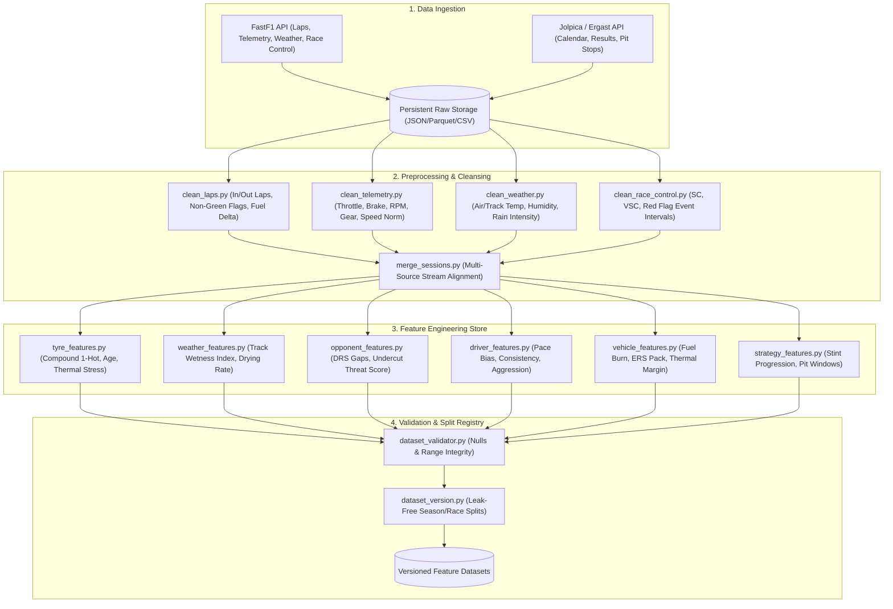

---

### 🧠 Sub-Architecture 2: Predictive Intelligence Model Hierarchy

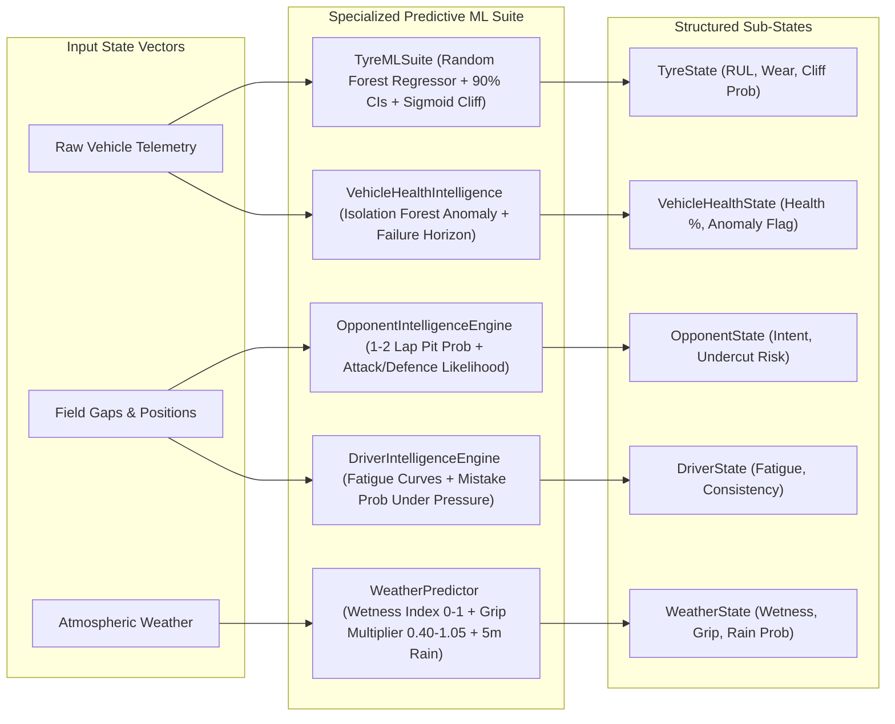

---

### 💾 Sub-Architecture 3: Digital Twin 3-Tier Memory & Persistence

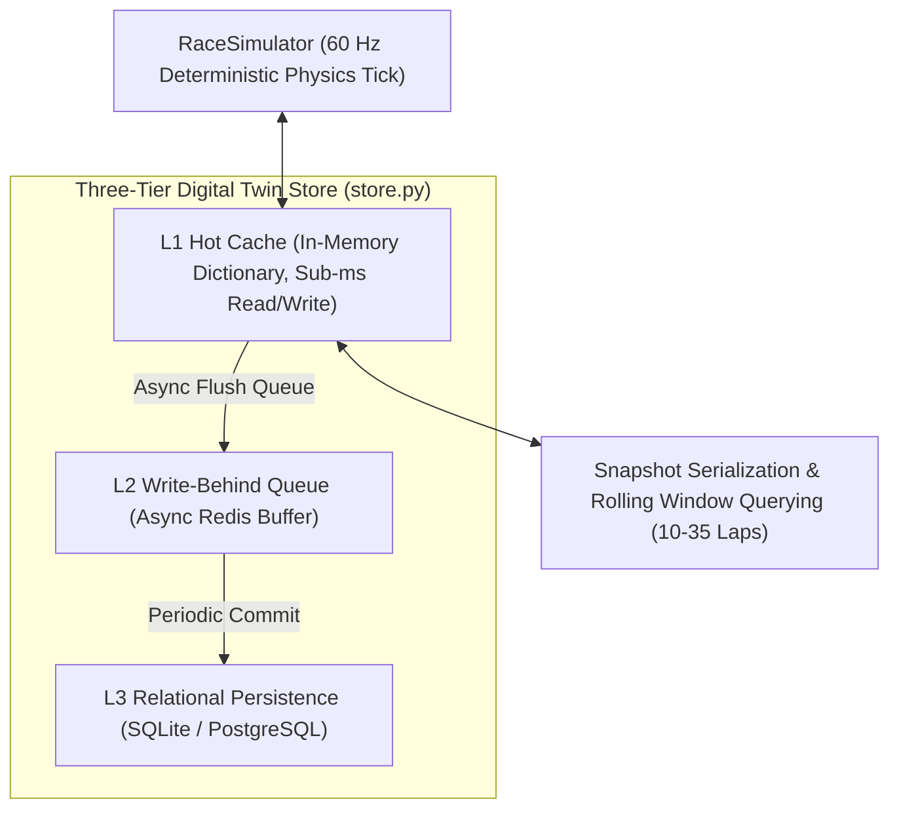

---

### 🎲 Sub-Architecture 4: Vectorized Monte Carlo & Counterfactual Engine

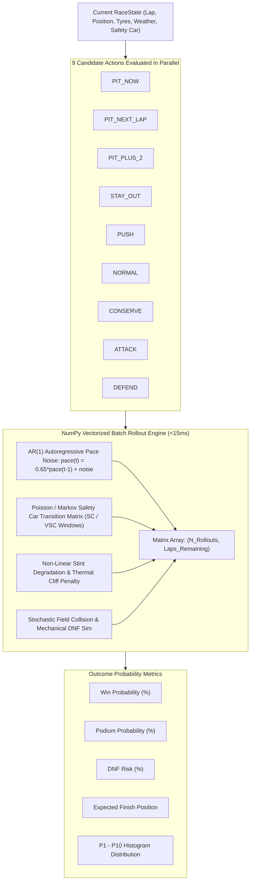

---

### 🤖 Sub-Architecture 5: Reinforcement Learning & Safe RL Guardrail

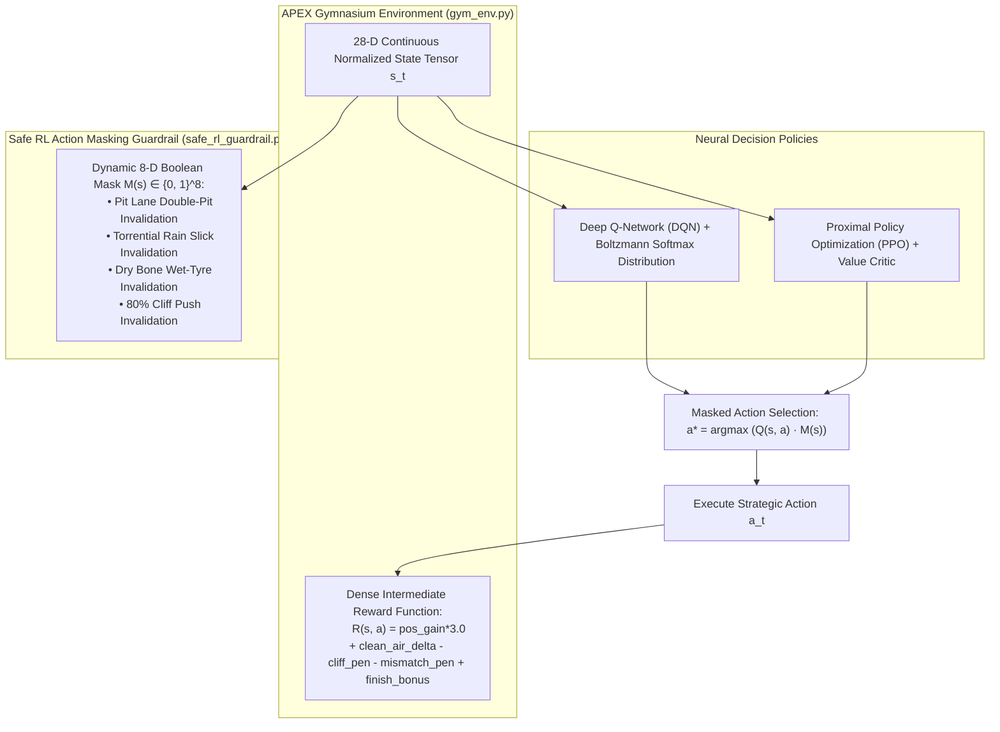

---

### 🚨 Sub-Architecture 6: Autonomous Emergency Brain Pipeline

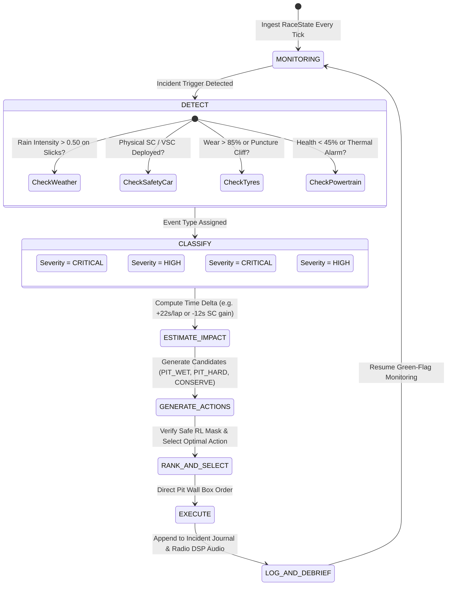

---

### ⚖️ Sub-Architecture 7: Multi-Factor Risk Engine & Decision Aggregator

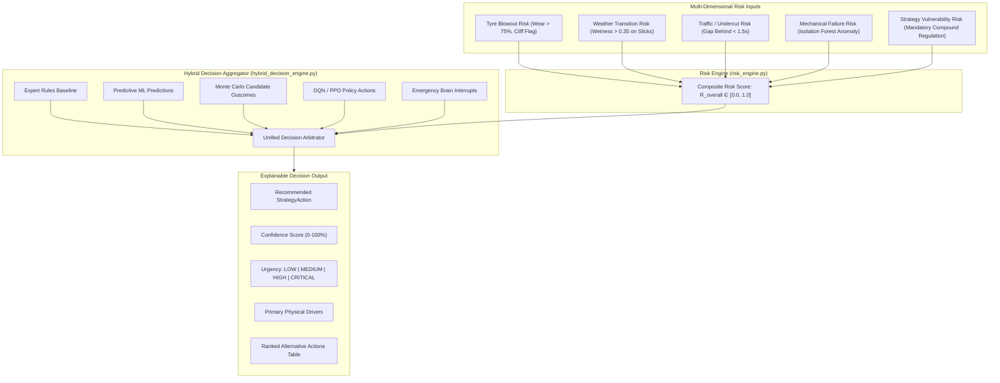

---

### 🏆 Sub-Architecture 8: Historical Race Replay & Championship Tournament

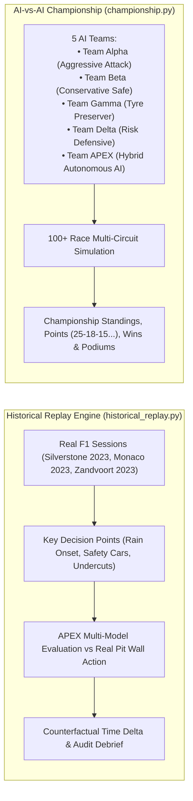

---

### 🖥️ Sub-Architecture 9: Frontend 10-Workspace React/Zustand Cockpit

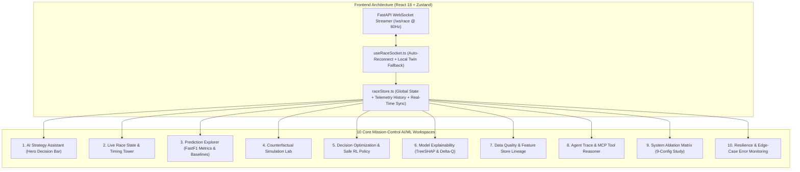

---

### 🤖 Sub-Architecture 10: LangGraph StateGraph Autonomous Orchestrator

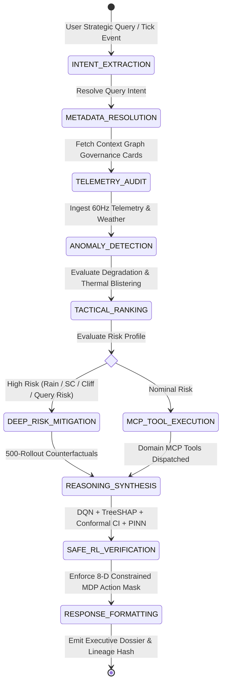

---

### 🔍 Sub-Architecture 11: Hybrid Mission RAG (FAISS + BM25 via RRF)

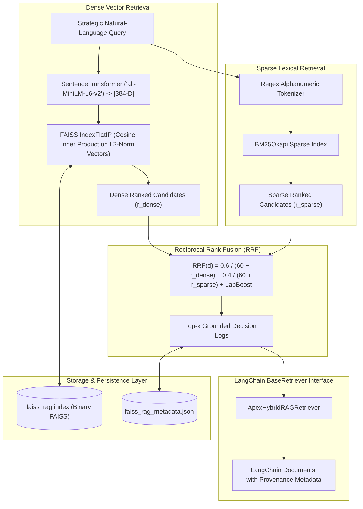

---

### ⚡ Sub-Architecture 12: Strategy Transformer & PEFT LoRA Fine-Tuning

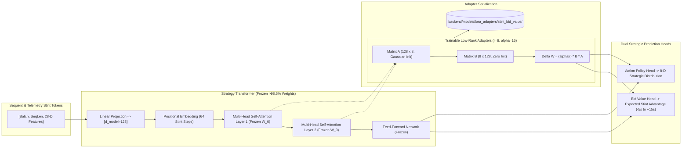

---

### 🛡️ Sub-Architecture 13: System Resilience & Graceful Degradation

APEX is engineered with zero-hard-dependency resilience: every database, cache, or neural model is fronted by deterministic fallbacks, local buffers, and explicit status signals.

| Subsystem / Dependency | Failure Mode | Fallback Path | Impact |
|---|---|---|---|
| **PostgreSQL 16** | Connection refused / timeout | SQLite local engine (`apex_twin.db`) | **Zero Downtime**. All telemetry & audit logs persist locally. |
| **Redis 7** | Socket error / connection refused | Thread-safe in-memory cache dict (`store.py`) | **Zero Downtime**. Telemetry broadcasts without dropping frames. |
| **Ollama / LLM** | HTTP connection refused / 500 | Deterministic rule-based radio synthesis | **Zero Downtime**. Emits structured radio messages grounded in delta Q. |
| **TreeSHAP Surrogates** | Model missing / weight drift | Exact analytical game-theoretic marginal calculation | **Zero Downtime**. Emits `DRIFT_DETECTED` warning; explanations valid. |
| **FastF1 Telemetry** | Rate limit / network error | Calibrated physics polynomial wear envelope | **Zero Downtime**. Logs `"synthetic_fallback"` status without fake data. |
| **Dense Embeddings** | PyTorch allocation error | Lexical BM25 token matching with strict refusal | **Zero Downtime**. Returns `"model_used": "deterministic_grounded_fallback"`. |
| **PINN Tyre Residuals** | Missing PyTorch weights | Base analytical tyre friction model ($\Delta \mu = 0$) | **Zero Downtime**. Proceeds with verified physical equations. |


